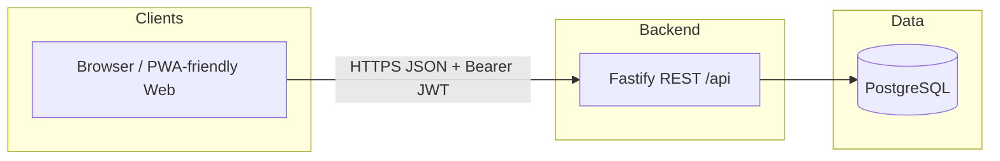
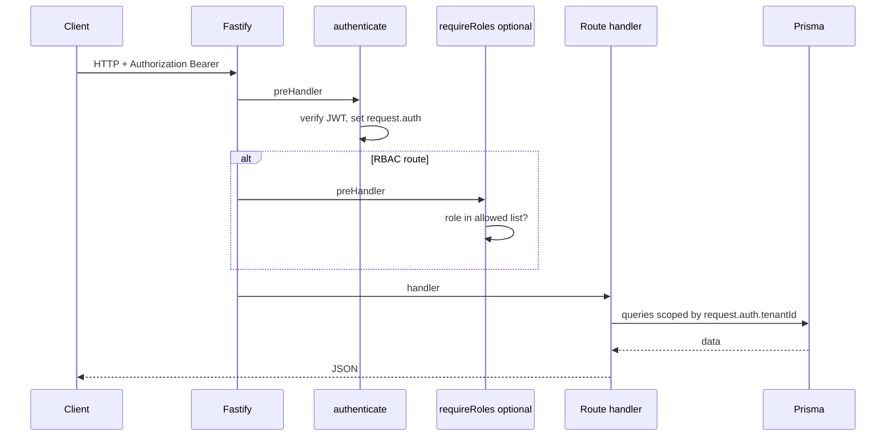
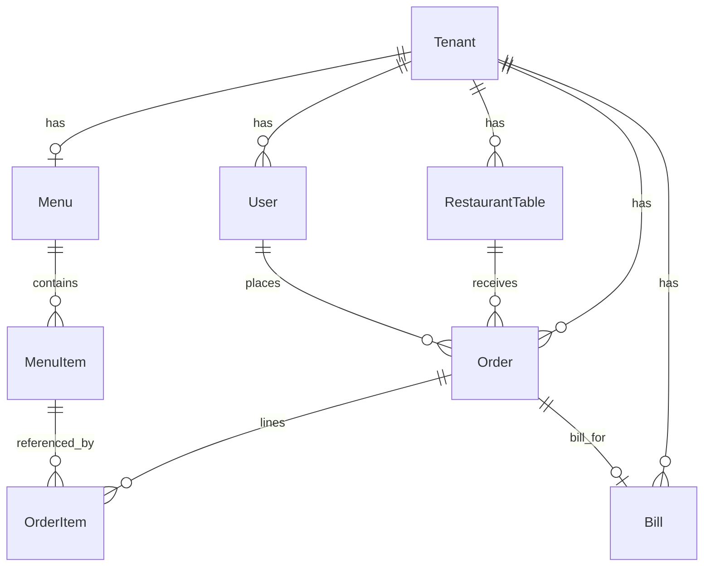

# DineOps — Technical Documentation

**Version:** 1.1 (MVP + billing) · **Stack:** React (Vite) + Fastify + PostgreSQL + Prisma  

This document describes the current implementation: **high-level design (HLD)**, **low-level design (LLD)**, **database schema**, **RBAC**, **APIs**, and **operational behaviour**.

---

## 1. Executive summary

DineOps is a **multi-tenant** restaurant operations app. Each **tenant** is one restaurant. Users authenticate with **JWT**; every protected API derives **`tenantId` and role from the token** (never from unchecked client fields). The product MVP includes **auth**, **staff**, **floor tables**, **versioned menu**, **orders** with a **kitchen workflow**, **billing** (bills, tax, plaintext receipts, mark paid), **analytics dashboard** (revenue from **paid** bills), and **mobile-friendly** shell (drawer nav, safe areas).

---

## 2. Technology stack

| Layer | Technology |
|--------|------------|
| Frontend | React 18, TypeScript, Vite, Tailwind CSS v4, Axios, Lucide icons |
| Backend | Node.js, Fastify 4, `@fastify/cors` |
| Data | PostgreSQL, Prisma ORM 5 |
| Auth | JWT (`jsonwebtoken`), bcrypt (cost 12) |
| Currency UI | `Intl.NumberFormat('en-IN', INR)` |

---

## 3. High-level design (HLD)

### 3.1 System context



### 3.2 Logical components

| Component | Responsibility |
|-----------|----------------|
| **Auth service** | Signup (tenant + admin user), login, JWT issuance |
| **Identity / session** | `GET /me`, `GET /admin/tenant` |
| **Staff service** | Admin-only CRUD for waiter/kitchen users |
| **Table service** | Floor tables; CRUD admin-only; status admin+waiter |
| **Menu service** | Per-tenant menu + items; mutations admin-only; reads all authenticated staff |
| **Order service** | Create orders (admin/waiter); list all staff; status transitions role-gated |
| **Billing service** | One **Bill** per **served** order; create bill (admin/waiter); fetch receipt text; mark paid (frees table) |
| **Analytics service** | Admin-only aggregates (dashboard + reports); revenue from paid bills |
| **Web app** | SPA: auth store, API client with Bearer, role-aware nav, screens |

### 3.3 Request flow (authenticated)



### 3.4 Multi-tenancy strategy

- **Model:** Shared database, shared schema, **row-level isolation** via `tenantId` on all tenant-owned entities.
- **Trust boundary:** `tenantId` is taken **only** from `request.auth` after JWT verification.
- **Queries:** Handlers explicitly use `where: { tenantId }` (and `findFirst` with `id` + `tenantId` for single-resource access).
- **Not yet implemented:** Global Prisma extension to auto-inject `tenantId` on every query/create (see §10 Roadmap).

---

## 4. Database schema

Physical table names: Prisma maps `RestaurantTable` → `restaurant_tables`, `Order` → `orders`, `Bill` → `bills`.

### 4.1 Entity relationship (conceptual)



### 4.2 Table definitions (logical)

#### `Tenant` (`Tenant`)

| Column | Type | Notes |
|--------|------|--------|
| `id` | UUID | PK |
| `name` | string | Restaurant display name |
| `ownerEmail` | string | Unique globally (signup identity for first restaurant) |
| `tier` | string | Default `'free'` |
| `isActive` | boolean | |
| `createdAt` | timestamp | |

#### `User` (`User`)

| Column | Type | Notes |
|--------|------|--------|
| `id` | UUID | PK |
| `tenantId` | UUID | FK → Tenant |
| `email` | string | **`@@unique([tenantId, email])`** |
| `passwordHash` | string | bcrypt |
| `role` | string | `admin` \| `waiter` \| `kitchen` (extensible string) |
| `isActive` | boolean | |

#### `RestaurantTable` (`restaurant_tables`)

| Column | Type | Notes |
|--------|------|--------|
| `id` | UUID | PK |
| `tenantId` | UUID | FK |
| `label` | string | **`@@unique([tenantId, label])`** |
| `capacity` | int | Default 4 |
| `status` | string | `empty` \| `occupied` \| `bill_pending` |
| `createdAt` | timestamp | |

#### `Menu` (`Menu`)

| Column | Type | Notes |
|--------|------|--------|
| `id` | UUID | PK |
| `tenantId` | UUID | **Unique** — one menu document per tenant |
| `version` | int | Increments on item mutations |
| `updatedAt` | timestamp | |

#### `MenuItem` (`MenuItem`)

| Column | Type | Notes |
|--------|------|--------|
| `id` | UUID | PK |
| `tenantId` | UUID | FK |
| `menuId` | UUID | FK → Menu |
| `category`, `name` | string | |
| `description` | string? | |
| `price` | decimal(10,2) | |
| `sortOrder` | int | |
| `isAvailable` | boolean | |

#### `Order` (`orders`)

| Column | Type | Notes |
|--------|------|--------|
| `id` | UUID | PK |
| `tenantId` | UUID | FK |
| `tableId` | UUID | FK → restaurant_tables; **onDelete Restrict** |
| `placedById` | UUID? | FK → User; null reserved for future QR/customer |
| `menuVersion` | int | Snapshot at order creation |
| `status` | string | `pending` → `preparing` → `ready` → `served` |
| `source` | string | `waiter` \| `qr` (QR not built) |
| `notes` | string? | |
| `createdAt` | timestamp | |
| *(relation)* | | Optional **`bill`** (1:1); see **`Bill`** |

#### `Bill` (`bills`)

| Column | Type | Notes |
|--------|------|--------|
| `id` | UUID | PK |
| `tenantId` | UUID | FK → Tenant |
| `orderId` | UUID | **Unique** FK → `orders` (one bill per order) |
| `subtotal` | decimal(10,2) | Sum of line totals before tax |
| `taxRate` | decimal(5,2) | Percentage (e.g. `5.00` for 5%) |
| `taxAmount` | decimal(10,2) | |
| `total` | decimal(10,2) | subtotal + tax |
| `paidAt` | timestamp? | Set when payment recorded; **null** = unpaid |
| `createdAt` | timestamp | |

#### `OrderItem` (`OrderItem`)

| Column | Type | Notes |
|--------|------|--------|
| `id` | UUID | PK |
| `orderId` | UUID | FK; cascade delete |
| `menuItemId` | UUID | FK; restrict delete |
| `quantity` | int | |
| `unitPrice` | decimal | **Frozen** at order time |
| `itemName` | string | **Frozen** at order time |
| `note` | string? | Per-line note |

---

## 5. Low-level design (LLD)

### 5.1 Backend layout

```
backend/
├── prisma/schema.prisma
├── src/
│   ├── server.ts              # Fastify bootstrap, CORS, route registration
│   ├── types/fastify.d.ts     # request.auth typing
│   ├── middleware/auth.ts     # authenticate, requireRoles
│   ├── lib/
│   │   ├── jwt.ts
│   │   ├── hash.ts
│   │   ├── prisma.ts
│   │   ├── menuTenant.ts      # getOrCreateMenu
│   │   ├── orderState.ts      # transitionForRole
│   │   └── receiptText.ts     # buildReceiptText (plaintext receipt)
│   └── routes/
│       ├── auth.ts            # POST /api/auth/signup | login
│       ├── me.ts              # GET /api/me, /api/admin/tenant
│       ├── staff.ts           # GET|POST /api/staff
│       ├── tables.ts          # /api/tables
│       ├── menu.ts            # /api/menu, /api/menu/items
│       ├── orders.ts          # /api/orders
│       ├── bills.ts           # /api/bills, /api/bills/:id/pay
│       └── analytics.ts      # /api/analytics/dashboard | reports
```

### 5.2 Frontend layout

```
frontend/src/
├── App.tsx                    # Auth shell, mobile drawer state, section routing
├── main.tsx, index.css
├── constants/navByRole.ts    # Client-side nav RBAC mirror
├── services/api.ts          # Axios + endpoints
├── store/authStore.ts
├── components/layout/       # Sidebar (drawer), Header (hamburger)
├── modules/
│   ├── auth/                # Login, SignUp
│   ├── dashboard/
│   ├── staff/
│   ├── tables/
│   ├── menu/
│   ├── orders/
│   ├── reports/
│   └── settings/
├── utils/
│   ├── money.ts              # formatInr
│   └── printPlainText.ts     # Browser print helper for receipts
```

### 5.3 JWT payload

After login/signup, tokens include:

```json
{
  "userId": "<uuid>",
  "tenantId": "<uuid>",
  "role": "admin | waiter | kitchen",
  "iat": 1712982200,
  "exp": 1713587000
}
```

- **Expiry:** 7 days (`JWT_EXPIRES_IN`).
- **Signing:** `JWT_SECRET` (env).

### 5.4 Auth middleware (LLD)

**`authenticate`** (`middleware/auth.ts`)

1. Read `Authorization: Bearer <token>`.
2. `verifyToken(token)` → `{ userId, tenantId, role }`.
3. On success, set `request.auth`.
4. On failure → **401** with `{ message }`.

**`requireRoles(...allowed)`**

1. Requires prior `authenticate`.
2. If `request.auth.role` not in `allowed` → **403** with explicit message listing required roles.

---

## 6. RBAC — design and implementation

### 6.1 Roles in the system

| Role | Typical use |
|------|-------------|
| **admin** | Restaurant owner / manager — full tenant operations |
| **waiter** | Floor — tables status, orders, menu read |
| **kitchen** | Back-of-house — advance orders to `preparing` / `ready` |

**Signup** creates the first user as **`admin`**. Additional **`waiter`** / **`kitchen`** users are created via **`POST /api/staff`** (admin-only).

### 6.2 Server-side enforcement (source of truth)

| Area | Rule |
|------|------|
| **Staff list / create** | `authenticate` + `requireRoles("admin")` |
| **Admin tenant details** | `GET /api/admin/tenant` — admin only |
| **Tables** | `GET` all authenticated; `POST`/`PATCH` (label/capacity)/`DELETE` **admin**; `PATCH .../status` **admin + waiter** (explicit check inside handler) |
| **Menu read** | All authenticated |
| **Menu write** | **admin** only (POST/PATCH/DELETE items) |
| **Orders list** | All authenticated |
| **Orders create** | **`requireRoles("admin", "waiter")`** |
| **Orders status** | **`PATCH /orders/:id/status`**: next state from **`transitionForRole(current, role)`**; **403** if role cannot advance |
| **Bills** | **`POST /bills`**, **`GET /bills/:id`**, **`PATCH /bills/:id/pay`** — **`requireRoles("admin", "waiter")`** |
| **Analytics** | **`requireRoles("admin")`** for dashboard + reports |

### 6.3 Order status transitions (RBAC + state machine)

Linear progression: **`pending` → `preparing` → `ready` → `served`**.

| From | To | Allowed roles |
|------|-----|----------------|
| `pending` | `preparing` | `kitchen`, `admin` |
| `preparing` | `ready` | `kitchen`, `admin` |
| `ready` | `served` | `waiter`, `admin` |

Implemented in **`backend/src/lib/orderState.ts`** (`transitionForRole`). **`orders.ts`** loads the order by `id` + `tenantId`, computes the single allowed next step for the caller’s role, then updates. When status becomes **`served`**, the **table** is set to **`bill_pending`**.

### 6.4 Client-side RBAC (UX only)

**`frontend/src/constants/navByRole.ts`**:

- **admin:** dashboard, orders, tables, menu, staff, reports, settings  
- **waiter:** orders, tables, menu (no dashboard by product choice)  
- **kitchen:** orders only  

`App.tsx` resets the active section if it is not allowed for the current role. **This does not replace server checks**; it prevents confusion and hides unavailable modules.

---

## 7. API reference (summary)

Base URL: **`/api`** (except auth under **`/api/auth`**).

| Method | Path | Auth | Roles / notes |
|--------|------|------|----------------|
| POST | `/auth/signup` | Public | Creates tenant + admin |
| POST | `/auth/login` | Public | |
| GET | `/me` | Bearer | Any active user |
| GET | `/admin/tenant` | Bearer | admin |
| GET | `/staff` | Bearer | admin |
| POST | `/staff` | Bearer | admin — body: `email`, `password`, `waiter` \| `kitchen` |
| GET | `/tables` | Bearer | all staff |
| POST | `/tables` | Bearer | admin |
| PATCH | `/tables/:id` | Bearer | admin |
| PATCH | `/tables/:id/status` | Bearer | admin, waiter |
| DELETE | `/tables/:id` | Bearer | admin |
| GET | `/menu` | Bearer | all staff |
| POST | `/menu/items` | Bearer | admin |
| PATCH | `/menu/items/:id` | Bearer | admin |
| DELETE | `/menu/items/:id` | Bearer | admin |
| GET | `/orders` | Bearer | optional `?status=&tableId=`; each order may include **`bill`** summary |
| POST | `/orders` | Bearer | admin, waiter |
| PATCH | `/orders/:id/status` | Bearer | role-gated step |
| POST | `/bills` | Bearer | admin, waiter — body: `orderId`, optional `taxRate` (default **5**); order must be **`served`**; returns `bill` + **`receiptText`** |
| GET | `/bills/:id` | Bearer | admin, waiter — `bill` + **`receiptText`** |
| PATCH | `/bills/:id/pay` | Bearer | admin, waiter — sets **`paidAt`**, table **`empty`**; returns updated **`receiptText`** |
| GET | `/analytics/dashboard` | Bearer | admin |
| GET | `/analytics/reports` | Bearer | admin |

CORS: configured for frontend origin; methods include GET, POST, PUT, PATCH, DELETE, OPTIONS.

---

## 8. Domain rules (implementation)

### 8.1 Menu versioning

- One **`Menu`** row per tenant; **`version`** increments when items are created/updated/deleted (in transactions).
- **`Order.menuVersion`** stores the version at placement time.
- **`OrderItem`** stores **`unitPrice`** and **`itemName`** snapshots for correct history if the menu changes.

### 8.2 Table lifecycle and billing

- New order **occupies** table (`RestaurantTable.status` → **`occupied`**).
- Order **`served`** → table → **`bill_pending`** (guest finished; payment may follow).
- **Bill** (admin/waiter): create only when order status is **`served`**, at most **one** bill per order. Amounts: **subtotal** from line items, **taxRate** (default 5%), **taxAmount**, **total**.
- **Mark paid** (`PATCH /bills/:id/pay`): sets **`Bill.paidAt`**, sets table **`empty`**. Plain-text receipt is generated server-side (`receiptText`) for display and printing.

### 8.3 Analytics (admin)

- **`/analytics/dashboard`:** today’s **revenue** from **paid bills** (`paidAt` in UTC calendar day, sum of **`total`**), table occupancy, **open orders** (kitchen queue **pending / preparing / ready** plus **served** orders awaiting payment — no bill or unpaid bill), active staff count, recent 5 orders (totals use paid bill amount when paid, else line sum).
- **`/analytics/reports`:** last 7 UTC days — order volume per day (all orders), **paid** revenue per day, top items by quantity from orders that have a **paid** bill in the window.

### 8.4 Orders API: bill summary

- **`GET /orders`** (and create/patch **order** responses when applicable) include optional **`bill`**: `{ id, subtotal, taxRate, taxAmount, total, paidAt }` for UI state (e.g. Orders screen: Create bill / Receipt / Mark paid).

---

## 9. Frontend implementation notes

- **API client:** Axios instance; `Authorization: Bearer` from `localStorage` (`dineops_token`).
- **Session:** `GET /me` on token present; **401** clears storage.
- **Mobile:** Sidebar drawer + backdrop; safe-area utilities; responsive tables (horizontal scroll or stacked cards); full-screen order sheet on small viewports.
- **Currency:** `formatInr()` — Indian Rupees display.
- **Billing UI (Orders):** admins/waiters can **create bill** (tax %), view monospace **receipt** (`pre`), **Print** via `printPlainText`, and **mark paid** when applicable.

---

## 10. Security checklist

| Item | Status |
|------|--------|
| Passwords hashed (bcrypt 12) | Yes |
| JWT expiry | Yes (7d) |
| Tenant ID from JWT only on protected routes | Yes |
| RBAC on sensitive routes | Yes |
| HTTPS in production | Operator responsibility |
| Rate limiting / lockout | Not implemented |
| Prisma global tenant scope extension | Not implemented — manual `tenantId` in queries |

---

## 11. Environment variables

**Backend**

- `DATABASE_URL` — PostgreSQL connection string  
- `JWT_SECRET` — signing secret  
- `PORT` — default 4000  
- `FRONTEND_ORIGIN` — CORS allowed origin(s); comma-separated list supported (default single origin `http://localhost:5173`)

After changing `schema.prisma`, run **`npx prisma generate`** (also runs on **`npm install`** via `postinstall` in `backend/package.json`) and restart the API.

**Deploy — Render**

- Repo root **`render.yaml`**: Blueprint for **free** Postgres + Node **web** service with **`rootDir: backend`**, **`startCommand`**: `npm run render-start` ( **`prisma db push`** then **`node`** — free tier has **no** pre-deploy; sync runs on each start), **`healthCheckPath`**: `/health`. Create via Dashboard → Blueprint, or adjust commands manually to match.
- Set **`FRONTEND_ORIGIN`** in the service to your frontend URL (required for browser CORS against production API).

**Deploy — Railway**

- **`backend/railway.toml`** documents build / release / start for the same backend.

**Frontend**

- `VITE_API_URL` — default `http://localhost:4000/api`

---

## 12. Roadmap / gaps (vs full product vision)

- **Payments** — bills record **mark paid** only; no card/UPI integrations, splits, or refunds.
- **QR ordering** — `source: qr` reserved; public routes not implemented.
- **Real-time** — no WebSockets/SSE.
- **Tenant middleware** — Prisma `$extends` to enforce `tenantId` on all operations.
- **Refresh tokens / server-side logout** — not implemented.

---

## 13. Document maintenance

- **Schema & routes** change in code first; update this file when adding models or changing RBAC.
- **Related:** `IMPLEMENTATION.md` (auth-focused walkthrough), `plan.md` (long-term product spec).

---

*Reflects the repository including billing, receipts, and paid-bill analytics (see §4–§8, §12).*
